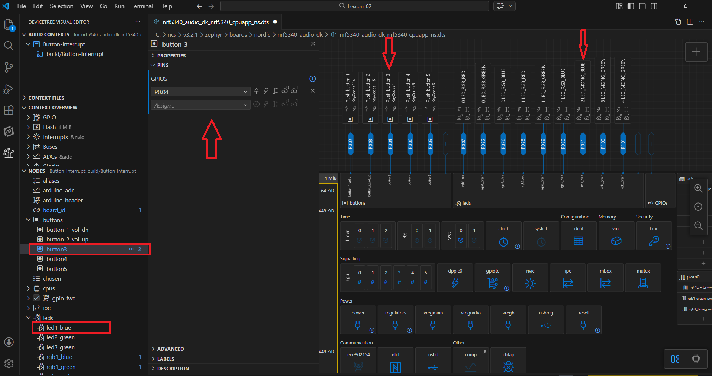
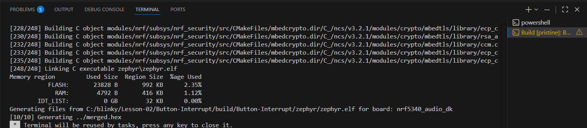

# Lesson 02: Interrupt-Driven GPIO Control (Button & LED)

## Overview
This lesson focuses on the transition from polling to an interrupt-driven approach for handling user inputs. Developed on the nRF5340 Audio Development Kit using nRF Connect SDK v3.2.1 and Zephyr RTOS, the project demonstrates how to utilize the Devicetree for hardware abstraction and manage GPIO callbacks.

## Technical Implementation
The implementation follows the Zephyr Device Driver Model to ensure hardware readiness before execution. Key features include:
- **Asynchronous Input:** Utilizing GPIO interrupts to detect button presses without blocking the main execution loop.
- **Hardware Abstraction:** Using `DT_NODELABEL` to decouple the application logic from physical pin numbers.
- **Callback Registration:** Configuring `gpio_callback` structures to handle edge-triggered events.

## Hardware Mapping
The peripheral configuration is derived from the board's Devicetree (`.dts`). The primary nodes used are:
* **Input (Button):** `button3` mapped to **P0.04**.
* **Output (LED):** `led1_blue` mapped to **P0.31**.

### Devicetree Snapshot:

## Build & Resource Analysis
The project was successfully compiled for the `nrf5340_audio_dk/nrf5340/cpuapp/ns` target. Memory utilization remains optimized as shown in the build logs below.

### Build Success Log:

### Memory Statistics:
* **Flash:** ~23.9 KB (2.36%)
* **RAM:** ~4.7 KB (1.12%)
